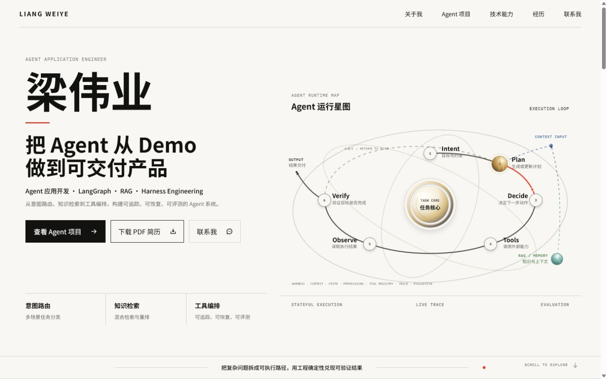
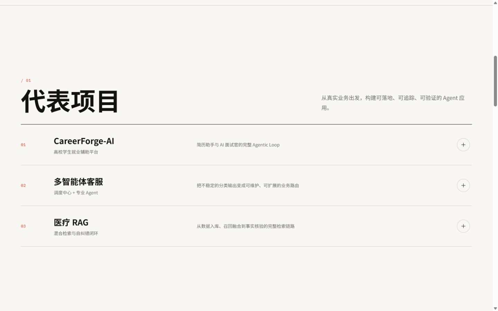
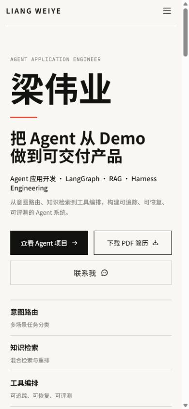

# 梁伟业｜Agent 应用开发

> 把 Agent 从 Demo 做到可交付产品。

这是梁伟业的个人作品集，聚焦 **Agent 应用开发、LangGraph、RAG 与 Harness Engineering**。页面以项目证据和 Agent 运行星图为核心，展示如何把意图路由、知识检索、工具编排、状态管理、追踪与评测组合成可落地、可追踪、可恢复、可评测的 Agent 系统。



## 作品集亮点

- **招聘者优先的信息架构**：首屏直接呈现个人定位、交付能力、技术方向、项目入口与能力证明。
- **可读的 Agent 运行语义**：用同一套 SVG 坐标系统一绘制流程轨道、箭头、节点和标签，避免响应式缩放时产生错位。
- **工程化执行循环**：完整表达 Intent、Plan、Decide、Tools、Observe、Verify 与 Output，并区分未通过校验时的回路。
- **独立的知识与可靠性层**：RAG / Memory 作为外部知识能力接入 Context；Harness 承载 State、Permissions、Tool Registry、Tracing 与 Evaluation。
- **响应式与可访问性**：适配桌面、平板与移动端，保留键盘焦点状态，并为 `prefers-reduced-motion` 提供降级体验。

## 代表项目

| 项目 | 关注的问题 | 关键实现 |
| --- | --- | --- |
| CareerForge-AI | 高校学生就业辅助流程 | 简历助手与 AI 面试官的完整 Agentic Loop |
| 多智能体客服 | 分类输出不稳定、业务路由难维护 | 调度中心、专业 Agent 与可扩展业务路由 |
| 医疗 RAG | 检索链路的召回质量与事实校验 | 混合检索、重排与自纠错闭环 |

## Agent 执行循环

```text
Intent → Plan → Decide → Tools → Observe → Verify → Output
            ↑                           │
            └────── 未通过校验 ─────────┘
```

- **Intent**：识别目标与约束。
- **Plan**：生成或更新执行计划。
- **Decide**：决定下一步动作。
- **Tools**：调用外部能力。
- **Observe**：读取并整理执行结果。
- **Verify**：验证目标是否完成；未通过时返回 Plan，通过后交付 Output。

RAG / Memory 不参与固定编号流程，而是通过 Context Input 为规划和决策提供知识与上下文。Harness 作为轻量工程边界，保障执行循环在状态、权限、工具注册、追踪和评测层面可靠运行。

## 技术栈

- **前端**：React 19、Vite 6、JavaScript、CSS
- **可视化**：原生 SVG、CSS 3D 与数据驱动节点生成
- **交互与图标**：Phosphor Icons、Intersection Observer、Pointer Events
- **质量保障**：Vitest、Testing Library、jsdom、响应式与 reduced-motion 检查

## 本地运行

建议使用 **Node.js 22 LTS**。

```bash
npm install
npm run dev
```

默认开发地址由 Vite 在终端输出。构建并预览生产版本：

```bash
npm run build
npm run preview
```

运行测试：

```bash
npm test -- --run
```

## 项目结构

```text
.
├─ public/               # 简历与公开静态资源
├─ src/
│  ├─ components/        # 首页模块与 Agent 运行星图
│  ├─ data/              # 项目、能力与经历数据
│  ├─ test/              # 测试环境与组件测试
│  ├─ App.jsx            # 单页作品集结构
│  └─ styles.css         # 设计变量、布局与响应式规则
├─ docs/images/          # README 展示截图
└─ vite.config.mjs       # Vite 与测试配置
```

## 页面预览

<table>
  <tr>
    <th width="68%">代表项目 · 桌面端</th>
    <th width="32%">首页 · 移动端</th>
  </tr>
  <tr>
    <td></td>
    <td></td>
  </tr>
</table>

## 联系方式

- GitHub：[github.com/lwxiaoye](https://github.com/lwxiaoye)
- 邮箱：[lwxiaoye@163.com](mailto:lwxiaoye@163.com)
- 方向：Agent / RAG / Full Stack
- 状态：2027 届，重庆，可实习 / 可合作
